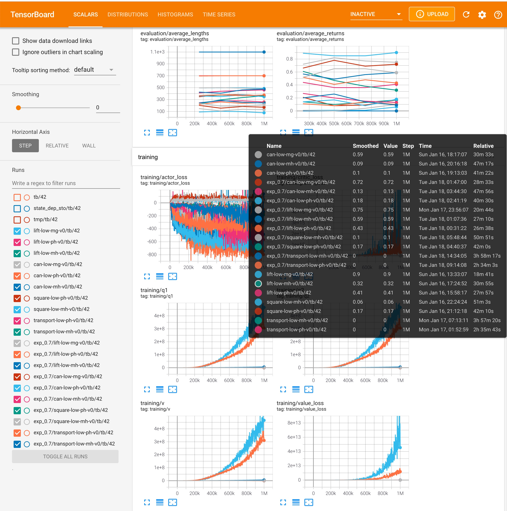

# Personal README note.

## Installation w/ conda

```
# Conda Libraries (CUDA, cudnn, etc.)
conda env create --file env.yaml --name iql-official
# in the case of error during creation, use conda update commands:
# conda env update --file env.yaml

# Env Variables
conda activate iql-official
mkdir -p $CONDA_PREFIX/etc/conda/activate.d $CONDA_PREFIX/etc/conda/deactivate.d
echo '#!/bin/sh\nexport XLA_FLAGS="--xla_gpu_cuda_data_dir=$CONDA_PREFIX"\nMJLIB_PATH=~/.mujoco/mujoco-2.1.1/lib/libmujoco.so.2.1.1\nexport LD_LIBRARY_PATH=$LD_LIBRARY_PATH:$CONDA_PREFIX/lib' > $CONDA_PREFIX/etc/conda/activate.d/env_vars.sh
echo '#!/bin/sh\nunset XLA_FLAGS\nunset MJLIB_PATH' > $CONDA_PREFIX/etc/conda/deactivate.d/env_vars.sh
conda deactivate
conda activate iql-official

# Install Python Libraries
pip install -r requirements_my.txt --no-deps
pip install "jax[cuda111]<=0.21.1" -f https://storage.googleapis.com/jax-releases/jax_cuda_releases.html
```

### Problem Shooting

- Cuda devkit installation failure
    ```
    subprocess.CalledProcessError: Command '['/home/joschnei/miniconda3/envs/jax/pkgs/cudatoolkit-dev/cuda_11.2.2_460.32.03_linux.run', '--silent', '--toolkit', '--toolkitpath=/tmp/tmpbrzf_94m', '--override']' returned non-zero exit status 139.
    ```
  - You have to delete the write-protected log file `/tmp/cuda-installer.log` manually.
  - Related resource [link](https://github.com/conda-forge/cudatoolkit-dev-feedstock/issues/44)
- JAX runtime error
    ```
    Traceback (most recent call last):
  File "train_offline.py", line 135, in <module>
    app.run(main)
  File "/home/wonjoon/.miniconda3/envs/iql-official/lib/python3.8/site-packages/absl/app.py", line 312, in run
    _run_main(main, args)
  File "/home/wonjoon/.miniconda3/envs/iql-official/lib/python3.8/site-packages/absl/app.py", line 258, in _run_main
    sys.exit(main(argv))
  File "train_offline.py", line 99, in main
    agent = Learner(FLAGS.seed,
  File "/home/wonjoon/implicit_q_learning/learner.py", line 92, in __init__
    actor = Model.create(actor_def,
  File "/home/wonjoon/implicit_q_learning/common.py", line 60, in create
    variables = model_def.init(*inputs)
  File "/home/wonjoon/implicit_q_learning/policy.py", line 34, in __call__
    outputs = MLP(self.hidden_dims,
  File "/home/wonjoon/implicit_q_learning/common.py", line 37, in __call__
    x = nn.Dense(size, kernel_init=default_init())(x)
  File "/home/wonjoon/.miniconda3/envs/iql-official/lib/python3.8/site-packages/flax/linen/linear.py", line 171, in __call__
    kernel = self.param('kernel',
  File "/home/wonjoon/.miniconda3/envs/iql-official/lib/python3.8/site-packages/jax/_src/nn/initializers.py", line 160, in init
    Q, R = jnp.linalg.qr(A)
  File "/home/wonjoon/.miniconda3/envs/iql-official/lib/python3.8/site-packages/jax/_src/numpy/linalg.py", line 468, in qr
    q, r = lax_linalg.qr(a, full_matrices)
  File "/home/wonjoon/.miniconda3/envs/iql-official/lib/python3.8/site-packages/jaxlib/cusolver.py", line 200, in geqrf
    lwork, opaque = cusolver_kernels.build_geqrf_descriptor(
RuntimeError: jaxlib/cusolver.cc:52: operation cusolverDnCreate(&handle) failed: cuSolver internal error
    ```
  - You are very likely forget to add the library path.
    ```
    export LD_LIBRARY_PATH=$LD_LIBRARY_PATH:$CONDA_PREFIX/lib
    ```
  - You can quickly check the jax runtime by executing the following command in python:
    ```
    import jax
    jax.default_backend()
    jax.random.PRNGKey(0)
    ```
- Mujoco compliation
    ```
    pip uninstall mujoco-py
    pip install mujoco-py==2.0.2.9 --no-cache-dir --no-binary :all: --no-build-isolation # use older versions.
    ```

## Installation from Scratch

### Base Installation
```
conda create --name iql-official
conda install python==3.8
conda install -c conda-forge cudnn==8.1.0.77
conda install -c conda-forge cudatoolkit-dev==11.2.2
conda install glew
pip install -r requirements.txt
pip install "jax[cuda111]<=0.21.1" -f https://storage.googleapis.com/jax-releases/jax_cuda_releases.html
pip install ipython
export LD_LIBRARY_PATH=$LD_LIBRARY_PATH:$CONDA_PREFIX/lib
```

## Installation for robomimic

```
conda install pytorch==1.6.0 torchvision==0.7.0 cpuonly -c pytorch
pip install robomimic==0.2.0
pip install git+ssh://git@github.com/ARISE-Initiative/robosuite.git@offline_study
```

## Training

```
python train_offline.py --env_name=antmaze-large-play-v0 --config=configs/antmaze_config.py --eval_episodes=100 --eval_interval=250000
python train_offline.py --env_name=lift-low-mg-v0 --config=configs/robomimic_config.py --eval_episodes=100 --eval_interval=250000 --save_dir ./tmp/lift-low-mg-v0
```

## Results

| Dataset | Type | BC | BC-RNN | BCQ | CQL | HBC | IRIS | IQL@0.9 | IQL@0.7 |
|---|---|---|---|---|---|---|---|---|---|
| Lift | (MG) | 65.3±2.5 | 70.7±3.4 | 91.3±1.9 | 64.0±2.8 | 47.3±4.1 | 96.0±1.6 | 90 | 75 |
| Can | (MG) | 64.7±3.4 | 68.7±2.5 | 75.3±0.9 | 1.3±0.9 | 40.7±3.4 | 48.0±6.5 | 59 | 72 |
| Lift | (PH) | 100.0±0.0 | 100.0±0.0 | 100.0±0.0 | 92.7±5.0 | 100.0±0.0 | 100.0±0.0 | 41 | 43 |
| Can | (PH) | 95.3±0.9 | 100.0±0.0 | 88.7±0.9 | 38.0±7.5 | 100.0±0.0 | 100.0±0.0 | 10 | 18 |
| Square | (PH) | 78.7±1.9 | 84.0±0.0 | 50.0±4.9 | 5.3±2.5 | 82.6±0.9 | 78.7±2.5 | 17 | 17 |
| Transport | (PH) | 17.3±2.5 | 71.3±6.6 | 7.3±3.3 | 0.0±0.0 | 48.6±3.8 | 41.3±3.4 | 0 | 0 |
| Tool-Hang | (PH) | 29.3±0.9 | 19.3±5.0 | 0.0±0.0 | 0.0±0.0 | 30.0±7.1 | 11.3±2.5 | 0 | 0 |
| Lift | (MH) | 100.0±0.0 | 100.0±0.0 | 100.0±0.0 | 56.7±40.3 | 100.0±0.0 | 100.0±0.0 | 32 | 43 |
| Can | (MH) | 86.0±4.3 | 100.0±0.0 | 62.7±8.2 | 22.0±5.7 | 91.3±2.5 | 92.7±0.9 | 9 | 18 |
| Square | (MH) | 52.7±6.6 | 78.0±4.3 | 14.0±4.3 | 0.7±0.9 | 60.7±5.0 | 52.7±5.0 | 6 | 17 |
| Transport | (MH) | 11.3±2.5 | 65.3±7.4 | 2.6±0.9 | 0.0±0.0 | 14.0±1.6 | 10.7±0.9 | 0 | 0 |



- Single run
- might require more tuning.

